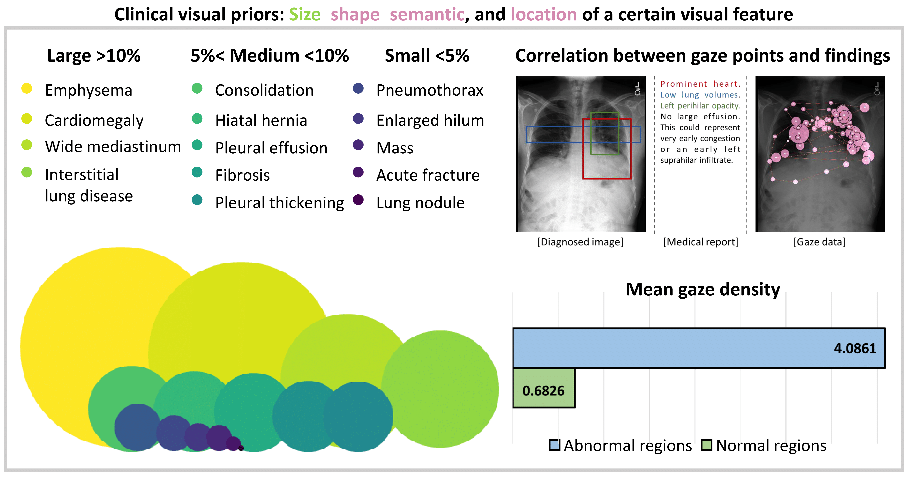
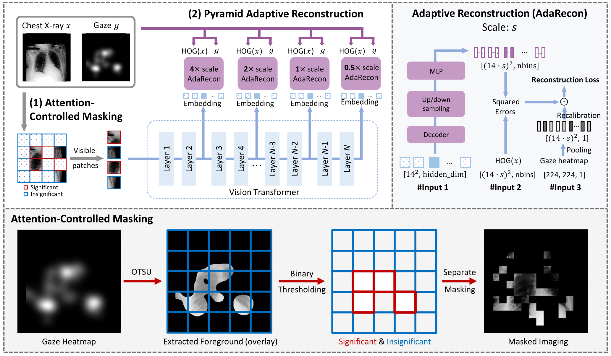

# [IPMI 2025] Taming Masked Image Modeling for Chest X-ray Diagnosis by Incorporating Clinical Visual Priors

by Zihao Zhao, Mei Wang, Zhiming Cui, Sheng Wang, Qian Wang, Dinggang Shen<br/>

## Motivation

<div align="center">
  
</div>

> <p align="justify"> 
> <b>Illustration of thoracic abnormalities of varying sizes and the alignment of gaze data with these regions.</b> (Left) shows the proportion of different abnormalities in relation to the entire image across the REFLACX dataset, categorized into three scales: small, medium, and large. (Top Right) qualitatively demonstrates how gaze data aligns closely with lesion regions, indicated by colored bounding boxes. (Bottom Right) provides quantitative results by computing gaze density for normal and abnormal regions, respectively. The average gaze density within abnormal regions is six times higher than that of normal regions.

</p>

## Method

<div align="center">
  
</div>

> <p align="justify"> 
> <b>Overview of our proposed CXR-MIM by using ViT-B/16 as the default vision backbone.</b>  CXR-MIM integrates (1) attention-controlled masking to preserve clinically significant features based on radiologist attention, and (2) pyramid adaptive reconstruction to reconstruct multi-scale HOG features using embeddings from selected transformer layers. The reconstruction loss is further adaptively weighted through recalibrated gaze heatmaps, emphasizing important regions during training.

</p>

## Usage

1. Put "vit_base_p16_224_timm.pth", the ImageNet pre-trained weight of ViT-B/16, under directory "preTrain/". It was originally provided by timm and can be accessed [here](https://drive.google.com/file/d/1dYG8s7ZlwgJZNz3AVdAia0qyQcIC6LBH/view?usp=drive_link).

2. To pre-train ViT-B/16 model on REFLACX dataset, run the following command:

```
PYTHONPATH="$(dirname $0)/..":$PYTHONPATH \
OMP_NUM_THREADS=1 python -m torch.distributed.launch --nproc_per_node 1 run_pretrain.py --batch_size 128 --model cxrmim_vit_base_patch16 \
--hog_nbins 9 --mask_ratio 0.75 --clinical_ratio 0.5 \
--epochs 400 --warmup_epochs 10 --blr 3e-3 --weight_decay 0.05  --num_workers 4 --preload --gaze_weighted --id_list 1 3 9 11 --scale_list 4.0 2.0 1.0 0.5 --decoder_depth 1 --decoder_num_heads 8 \
--data_path "../data/reflacx-1.0.0/" --output_dir "./output_dir/cxrmim/"
```

3. The pretrained weight of CXR-MIM can be accessed [here](https://drive.google.com/file/d/1wmkRKPJct0StBvt0HOLK0x9HkSozQMxC/view?usp=drive_link).

4. For downstream evaluation, please follow instructions in this [repo](https://github.com/zhaozh10/cxr-eval).

## License

This project is under the Apache License 2.0 license. See [LICENSE](LICENSE) for details.
